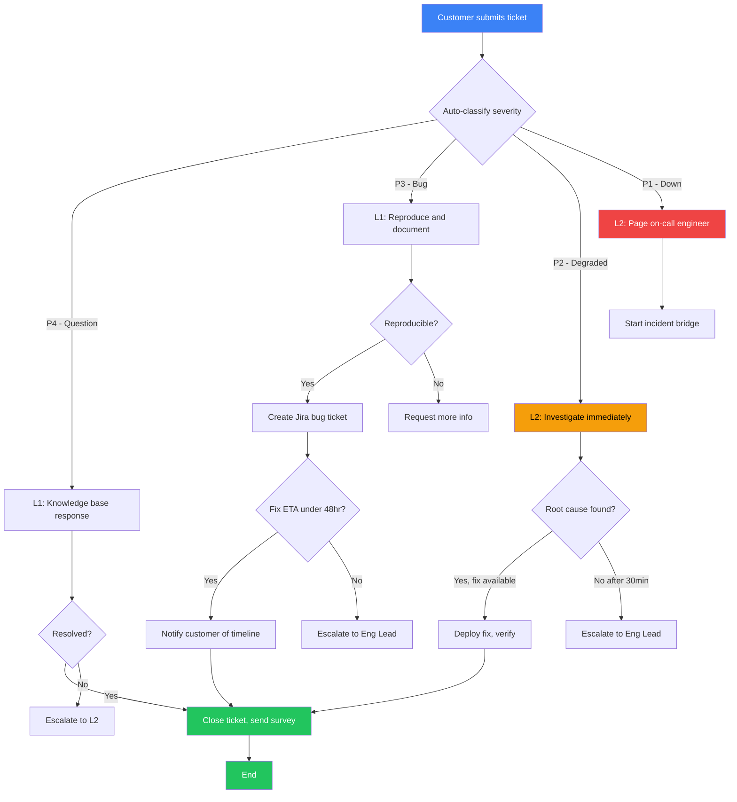

# Document Types — Complete Reference

Full templates, filled examples, common pitfalls, and decision guide for all 5 document types.

---

## Decision Guide: Which Document Type?

Use this flowchart to pick the right type:

```
What are you documenting?
    │
    ├── A repeatable business process?
    │   └── → SOP
    │
    ├── A technical operation or incident response?
    │   └── → Runbook
    │
    ├── A situation with multiple possible responses?
    │   └── → Playbook
    │
    ├── A verification/pre-launch check?
    │   └── → Checklist
    │
    └── A workflow with decision branches?
        └── → Process Map
```

### Quick Comparison

| Feature | SOP | Runbook | Playbook | Checklist | Process Map |
|---------|-----|---------|----------|-----------|-------------|
| Linear flow | Yes | Yes | No (branching) | Yes | No (branching) |
| Technical commands | Sometimes | Always | Rarely | Sometimes | No |
| Decision trees | Minimal | Minimal | Central | No | Central |
| Rollback steps | Optional | Required | N/A | N/A | N/A |
| Visual diagram | Optional | Optional | Optional | No | Required |
| Time estimates | Per step | Per step | Per play | No | Per step |
| Best format | Markdown | Markdown | Markdown | Markdown | Markdown + Mermaid |

---

## 1. SOP — Full Example

### Customer Onboarding SOP

```markdown
# Customer Onboarding SOP

## Document Info
| Field | Value |
|-------|-------|
| Owner | Sarah Chen, Head of Customer Success |
| Last Updated | 2026-03-01 |
| Review Schedule | Quarterly (next: 2026-06-01) |
| Version | 2.1 |
| Approved By | James Rivera, VP Operations |

## Purpose
Ensure every new customer receives a consistent, high-quality onboarding experience
that leads to product activation within 7 days and reduces churn in the first 90 days.

## Scope
Applies to all new customers on paid plans (Starter, Growth, Enterprise).
Does NOT apply to free trial users (see Trial Nurture SOP) or self-serve customers
who explicitly opt out of guided onboarding.

## Roles & Responsibilities
| Role | Responsibility | Person/Team |
|------|---------------|-------------|
| CSM (Customer Success Manager) | Lead onboarding, primary contact | CS Team |
| Solutions Engineer | Technical setup and integration | Engineering |
| Account Executive | Warm intro, context handoff | Sales Team |

## Prerequisites
- [ ] Customer has signed contract and payment is processed
- [ ] CRM record is complete (company size, use case, key contacts)
- [ ] AE has completed internal handoff doc with customer goals
- [ ] CSM has been assigned in the CRM
- [ ] Customer's account is provisioned in the product

## Procedure

### Step 1: Send Welcome Email
**Owner:** CSM
**Time estimate:** 5 minutes
**Timing:** Within 2 hours of contract signing

Send the welcome email template from the CS playbook. Personalize:
- Customer name and company name
- Reference their specific use case from the AE handoff doc
- Include calendar link for kickoff call
- Attach the onboarding timeline PDF

**Checkpoint:** Email sent confirmation in CRM, calendar link included.

### Step 2: Schedule Kickoff Call
**Owner:** CSM
**Time estimate:** 5 minutes
**Timing:** Within 24 hours of welcome email

Book a 45-minute kickoff call within the first 3 business days.
Invite: Customer champion + up to 2 additional stakeholders.
Internal attendees: CSM + Solutions Engineer (if technical setup needed).

**Checkpoint:** Calendar invite sent to all parties, agenda attached.

### Step 3: Conduct Kickoff Call
**Owner:** CSM
**Time estimate:** 45 minutes
**Timing:** Within 3 business days of contract

Agenda:
1. Introductions (5 min)
2. Confirm goals and success metrics (10 min)
3. Product walkthrough tailored to their use case (15 min)
4. Technical setup plan — timeline and owners (10 min)
5. Q&A and next steps (5 min)

**Checkpoint:** Meeting notes shared with customer within 2 hours. Success metrics documented in CRM.

### Step 4: Configure Customer Account
**Owner:** Solutions Engineer
**Time estimate:** 30–60 minutes
**Timing:** Within 24 hours of kickoff call

Configure:
- Workspace settings based on company size
- Integration connections (SSO, Slack, CRM sync)
- Import existing data if applicable
- Set up user roles and permissions per customer request

**Checkpoint:** All configurations tested. Confirmation email sent to customer with login instructions.

### Step 5: Conduct Training Session
**Owner:** CSM
**Time estimate:** 30 minutes
**Timing:** Within 5 business days of kickoff

Cover:
- Core workflow relevant to their use case
- Top 3 features that drive their success metric
- How to get help (support portal, chat, CSM contact)
- Admin features for their team lead

**Checkpoint:** Training recording shared. Customer confirms understanding of core workflow.

### Step 6: Day-7 Check-In
**Owner:** CSM
**Time estimate:** 15 minutes
**Timing:** 7 days after account activation

Verify:
- Has the customer logged in at least 3 times?
- Have they completed their primary workflow at least once?
- Are there any blockers or unanswered questions?

If activation metrics are NOT met → schedule a follow-up call within 48 hours.

**Checkpoint:** Activation status updated in CRM. Follow-up scheduled if needed.

### Step 7: Day-30 Success Review
**Owner:** CSM
**Time estimate:** 30 minutes
**Timing:** 30 days after activation

Review:
- Progress toward success metrics defined in kickoff
- Usage data and adoption trends
- Feedback and feature requests
- Expansion opportunities

**Checkpoint:** 30-day review notes in CRM. Success score updated. Escalate if at-risk.

## Exceptions & Edge Cases
| Scenario | Action |
|----------|--------|
| Customer is unresponsive to welcome email | Send follow-up after 48 hours. If no response in 5 days, AE reaches out. |
| Customer wants to skip kickoff call | Send async onboarding video + setup guide. Schedule Day-7 check-in regardless. |
| Technical integration fails | Solutions Engineer escalates to Engineering Lead within 4 hours. CSM informs customer of timeline. |
| Customer champion leaves during onboarding | Identify new champion with AE's help. Restart from Step 2. |
| Enterprise customer (50+ seats) | Add dedicated Solutions Engineer for full onboarding period. Weekly check-ins for first 30 days. |

## Escalation Path
1. First: CSM discusses with CS Team Lead (Slack: #cs-escalations)
2. If unresolved in 24 hours: Head of Customer Success reviews
3. If customer at risk of churning: VP Operations + AE involved within 4 hours

## Success Criteria
- [ ] Customer achieves first activation event within 7 days
- [ ] Customer reports satisfaction score of 4+ out of 5 at Day-30 review
- [ ] All onboarding steps completed and documented in CRM
- [ ] No unresolved support tickets from onboarding period

## Revision History
| Date | Version | Change | Author |
|------|---------|--------|--------|
| 2026-03-01 | 2.1 | Added Enterprise exception for 50+ seats | Sarah Chen |
| 2026-01-15 | 2.0 | Restructured with Day-7 and Day-30 checkpoints | Sarah Chen |
| 2025-10-01 | 1.0 | Initial version | James Rivera |
```

### Common SOP Pitfalls

1. **Steps without owners** — every step must have a named role
2. **Missing time estimates** — people can't plan if they don't know how long things take
3. **No exception handling** — the "happy path" is only half the document
4. **Stale documents** — set a review schedule and stick to it
5. **Too granular** — document the process, not every mouse click. Use judgment on detail level
6. **No success criteria** — how do you know the SOP was followed correctly?

---

## 2. Runbook — Full Example

### Database Failover Runbook

```markdown
# Database Failover Runbook

## Overview
| Field | Value |
|-------|-------|
| System/Service | PostgreSQL Primary Database (prod-db-01) |
| Owner | Platform Engineering Team |
| Severity | P1 — Critical |
| Last Tested | 2026-02-15 (quarterly drill) |
| Last Updated | 2026-02-20 |

## When to Use This Runbook

**Trigger conditions:**
- Alert: "postgres-primary-down" fires in PagerDuty
- Alert: "replication-lag-critical" (lag > 30 seconds for > 2 minutes)
- Error: Connection refused on prod-db-01:5432 after retry
- Symptom: Multiple services reporting database connection errors simultaneously

**Do NOT use this runbook for:**
- Slow queries (see: Query Performance Runbook)
- Single-service connection issues (likely app-level, check service health first)
- Planned maintenance (see: DB Maintenance SOP)

## Prerequisites
- [ ] SSH access to prod-db-01 and prod-db-02 (replica)
- [ ] psql client installed locally
- [ ] Access to AWS Console (RDS section) or direct server access
- [ ] PagerDuty access to acknowledge and update the incident
- [ ] Slack: joined #incidents channel
- [ ] Database admin credentials in 1Password vault: "Prod DB Admin"

## Procedure

### Step 1: Assess Database State
**Time estimate:** 3 minutes

Acknowledge the PagerDuty alert and post in #incidents:
"Investigating database primary failure. Assessing state now."

Check primary database status:
```bash
ssh prod-db-01 "pg_isready -h localhost -p 5432"
```

Expected output if healthy: `localhost:5432 - accepting connections`
Expected output if down: `localhost:5432 - no response` or connection refused

Check replica status:
```bash
ssh prod-db-02 "pg_isready -h localhost -p 5432"
```

Check replication lag:
```bash
ssh prod-db-02 "psql -U admin -c \"SELECT now() - pg_last_xact_replay_timestamp() AS replication_lag;\""
```

**Decision:**
- Primary is up + lag is small → likely transient. Monitor for 5 minutes.
- Primary is down + replica is healthy → proceed to Step 2 (failover).
- Both are down → ESCALATE IMMEDIATELY to CTO.

### Step 2: Promote Replica to Primary
**Time estimate:** 5 minutes

Update #incidents: "Primary confirmed down. Promoting replica to primary now."

Promote the replica:
```bash
ssh prod-db-02 "pg_ctl promote -D /var/lib/postgresql/data"
```

Verify promotion:
```bash
ssh prod-db-02 "psql -U admin -c \"SELECT pg_is_in_recovery();\""
```

Expected output: `f` (false — no longer in recovery/replica mode)

### Step 3: Update Connection Strings
**Time estimate:** 5 minutes

Update the database connection endpoint to point to prod-db-02.

If using DNS-based routing:
```bash
aws route53 change-resource-record-sets --hosted-zone-id ZXXXXX \
  --change-batch file://failover-dns-change.json
```

Restart affected services:
```bash
kubectl rollout restart deployment/api-server -n production
kubectl rollout restart deployment/worker -n production
```

### Step 4: Verify Services Are Healthy
**Time estimate:** 5 minutes

Check API health:
```bash
curl -s https://api.company.com/health | jq .
```

Expected: `{"status": "healthy", "database": "connected"}`

Check Grafana dashboard for normalized metrics (response times, error rate, connection pool).

Update #incidents: "Failover complete. Services restored. Monitoring for stability."

### Step 5: Investigate Root Cause
**Time estimate:** 30–60 minutes (can be async)

Check what happened to the primary:
```bash
ssh prod-db-01 "tail -100 /var/log/postgresql/postgresql.log"
```

Common causes: disk full (`df -h`), OOM kill (`dmesg | grep -i oom`), hardware failure, network partition.

Document findings in incident ticket.

## Rollback Procedure

If promotion causes data inconsistency or services can't connect:

### Rollback Step 1: Restore Original Primary (if recoverable)
```bash
ssh prod-db-01 "pg_ctl start -D /var/lib/postgresql/data"
ssh prod-db-01 "pg_isready -h localhost -p 5432"
```

### Rollback Step 2: Revert Connection Strings
Point DNS back to prod-db-01 and restart services.

### Rollback Step 3: Verify
Confirm API health and database connections restored.

If rollback is not possible: Escalate to CTO immediately. Consider restoring from latest backup.

## Escalation
| Condition | Escalate To | Contact |
|-----------|-------------|---------|
| Failover step fails | Senior DB Admin | Slack DM + phone |
| Both primary and replica down | CTO + VP Engineering | PagerDuty P1 |
| Data loss suspected | CTO + Legal | Phone immediately |
| Downtime exceeds 15 minutes | CEO for customer comms | Slack: #exec-alerts |

## Post-Incident
1. Update #incidents with resolution summary within 1 hour
2. Schedule post-mortem within 48 hours
3. Document timeline in incident report
4. Create follow-up tickets: rebuild replica, investigate root cause, improve monitoring
5. Update this runbook if steps were unclear or incorrect
6. Run a failover drill within 30 days

## Related Runbooks
- Query Performance Runbook
- Database Backup Restore Runbook
- Service Health Check Runbook
```

### Common Runbook Pitfalls

1. **Missing expected outputs** — every command should say what "good" looks like
2. **No rollback procedure** — if you can't undo it, it's not a runbook, it's a gamble
3. **Untested** — runbooks must be dry-run regularly. Untested runbooks fail when you need them most
4. **Missing prerequisites** — nothing worse than scrambling for SSH keys during an incident
5. **No escalation contacts** — "escalate to engineering" means nothing at 3 AM
6. **Commands without context** — explain WHY each command is run, not just WHAT it does

---

## 3. Playbook — Full Example

### Sales Objection Handling Playbook

```markdown
# Sales Objection Handling Playbook

## Objective
Convert 70%+ of qualified prospects who raise objections during sales calls into customers
by addressing concerns with empathy, evidence, and clear next steps.

## Context
Objections are buying signals — they mean the prospect is engaged enough to voice concerns.
This playbook provides response frameworks for the most common objections, based on analysis
of 200+ sales calls.

## Decision Framework

When a prospect raises an objection:

```
Prospect objects
    │
    ├── "Too expensive" → Play 1: Price Objection
    ├── "We already use X" → Play 2: Competitor Lock-in
    ├── "Not the right time" → Play 3: Timing Objection
    ├── "Need to check with my boss" → Play 4: Authority Escalation
    ├── "We can build this ourselves" → Play 5: Build vs Buy
    └── "Not sure it'll work for us" → Play 6: Fit Uncertainty
```

## Play 1: Price Objection — "It's too expensive"

**Trigger:** Prospect mentions price, budget, cost, or compares to cheaper alternatives.
**Goal:** Reframe from cost to value and ROI.
**Owner:** Account Executive

### Steps:
1. **Acknowledge** — "I completely understand. Budget decisions are important."
2. **Probe deeper** — "Is it the total price, or the value relative to the cost?"
3. **Quantify the problem** — "You mentioned {X hours/week} spent on {problem}. That's roughly ${amount}/month in labor."
4. **Present ROI** — "Customers typically see {metric} within {timeframe}. For your size, that's ${savings} in savings."
5. **Offer flexibility** — Annual billing, starter plans, or phased rollout options.
6. **Advance** — "Would a custom ROI analysis help?"

### Key Messages:
- "The cost of NOT solving this is ${X}/month"
- "Average customer sees payback within {N} months"
- "Not the cheapest, but the one that works"

### What NOT to Do:
- Don't immediately offer a discount — it undermines value
- Don't compare prices to competitors — compete on value
- Don't get defensive about pricing

### Measure Success:
- 65%+ of price objections advance to next stage
- Average discount under 15%

## Play 2: Competitor Lock-in — "We already use X"

**Trigger:** Prospect mentions a competing product.
**Goal:** Differentiate and create urgency to switch.
**Owner:** Account Executive

### Steps:
1. **Acknowledge** — "That makes sense. What's working well for you with them?"
2. **Find the gap** — "What's the one thing you wish they did better?"
3. **Differentiate** — "That's exactly the gap we fill. {Differentiator} means {benefit}."
4. **Reference proof** — "{Similar company} switched and saw {result} in {timeframe}."
5. **De-risk** — "We handle migration. Most customers are live in {timeframe}."
6. **Create urgency** — "The longer you stay, the more {problem} compounds."

### What NOT to Do:
- Don't trash the competitor
- Don't assume they hate their current solution
- Don't skip "what's working well" — it builds trust

## Plays 3–6: Follow the same structure for Timing, Authority, Build vs Buy, and Fit Uncertainty objections.

## Escalation Matrix
| Severity | Who Decides | Response Time |
|----------|-------------|---------------|
| Standard objection | AE handles | Real-time |
| >20% discount request | Sales Manager | 24 hours |
| Enterprise custom terms | VP Sales + Legal | 48 hours |
| Competitive displacement | VP Sales leads | Same day |

## Metrics & Iteration
| Metric | Target | Review Frequency |
|--------|--------|-----------------|
| Objection-to-advance rate | 65% | Weekly standup |
| Average discount given | <15% | Monthly |
| Win rate after objection | 45% | Monthly |
| Time to resolve objection | <2 follow-ups | Quarterly |

Review this playbook: Monthly at Sales All-Hands
```

### Common Playbook Pitfalls

1. **Too rigid** — playbooks guide, they don't script. Allow judgment
2. **Missing "what NOT to do"** — mistakes are as instructive as correct actions
3. **No measurement** — can't improve what you can't measure
4. **Not updated from experience** — update plays after every major deal
5. **Too many plays** — 5-8 per playbook is ideal. More than 10 means split it

---

## 4. Checklist — Full Example

### Product Launch Checklist

```markdown
# Product Launch Checklist

## When to Use
Complete 48 hours before any public product launch or major feature release.

## Owner
Product Manager (sign-off from Engineering Lead and Marketing Lead)

## Checklist

### Engineering
- [ ] All launch-blocking tickets resolved (Jira filter: "Launch Blockers")
- [ ] Feature flag configured and tested (on for beta, off for public)
- [ ] Load testing completed — handles 3x expected traffic
- [ ] Rollback plan documented and tested
- [ ] Monitoring alerts configured (error rate, latency, CPU)
- [ ] Database migrations run in staging and verified
- [ ] API documentation updated

### Product
- [ ] Release notes drafted and approved
- [ ] In-app onboarding configured for new features
- [ ] Analytics events firing correctly for key actions
- [ ] Pricing page updated (if applicable)
- [ ] Support team briefed with FAQ and escalation path

### Marketing
- [ ] Launch blog post scheduled
- [ ] Social media posts scheduled (LinkedIn, Twitter, ProductHunt)
- [ ] Email announcement drafted and list finalized
- [ ] Landing page live and tested (mobile + desktop)
- [ ] Press outreach completed (if applicable)

### Legal & Compliance
- [ ] Terms of Service updated (if data handling changes)
- [ ] Privacy policy reviewed (if new data collection)
- [ ] GDPR/CCPA compliance verified

### Launch Day
- [ ] War room channel created: #launch-{feature-name}
- [ ] All team leads confirmed available
- [ ] Support staffing increased for 48 hours
- [ ] Feature flag flipped at scheduled time
- [ ] Announcement sent within 30 minutes of flip
- [ ] Monitor dashboards for 2 hours post-launch

### Post-Launch (within 72 hours)
- [ ] Collect initial feedback from support and social
- [ ] Review analytics — key metrics trending as expected?
- [ ] Publish retrospective notes
- [ ] Update roadmap with follow-up items

## Sign-Off
| Role | Name | Date | Confirmed |
|------|------|------|-----------|
| Product Manager | | | |
| Engineering Lead | | | |
| Marketing Lead | | | |

## Notes
{Exceptions, risks, or context specific to this launch}
```

### Common Checklist Pitfalls

1. **Too long** — 50+ items means break into sub-checklists
2. **Not specific** — "Test the feature" is not actionable. "Run test suite X, verify Y" is
3. **No owner** — a checklist without an owner is a wishlist
4. **Not used** — if skipped, it's too long or not useful. Fix it
5. **One-time** — checklists should be reusable templates

---

## 5. Process Map — Full Example

### Customer Support Escalation Flow

```markdown
# Customer Support Escalation Process

## Overview
Defines how support tickets are triaged, handled, and escalated based on severity.
Covers ticket creation to resolution with decision points for engineering escalation.

## Process Diagram



## Step Details

### Trigger: Customer Submits Ticket
**Owner:** Support system (auto-created)
**Input:** Customer description, account info, auto-classified severity

### Decision: Auto-Classify Severity
| Condition | Severity | Route |
|-----------|----------|-------|
| "how to", "question" keywords | P4 | L1: Knowledge base |
| "bug", "error", "broken" keywords | P3 | L1: Reproduce |
| "slow", "degraded" + multiple users | P2 | L2: Investigate |
| "down", "outage" + monitoring confirms | P1 | L2: Page on-call |

### Action: L1 Knowledge Base Response
**Owner:** L1 Support Agent
**Time:** 15 minutes
**Details:** Search KB for match. Share with customer. If not found, resolve manually within 30 min.

### Action: L2 Investigation
**Owner:** L2 Support Engineer
**Time:** 30 minutes initial
**Details:** Check logs, reproduce, identify root cause. Update customer every 30 min.

### Action: Incident Bridge (P1)
**Owner:** On-call engineer + Engineering Lead
**Details:** Follow Incident Response Runbook. Communicate via #incidents.

## Owner Matrix
| Step | Owner | Backup | SLA |
|------|-------|--------|-----|
| Ticket triage | Auto-classification | L1 Lead | Immediate |
| P4 response | L1 Agent | L1 Lead | 4 hours |
| P3 response | L1 Agent | L2 Engineer | 2 hours |
| P2 investigation | L2 Engineer | Eng Lead | 30 minutes |
| P1 response | On-call Engineer | Eng Lead | 15 minutes |

## Metrics
| Metric | Target |
|--------|--------|
| First response time | P1: 15min, P2: 30min, P3: 2hr, P4: 4hr |
| Resolution time | P1: 2hr, P2: 8hr, P3: 48hr, P4: 72hr |
| Escalation rate (L1→L2) | <25% |
| CSAT score | >4.2 / 5.0 |
| First-contact resolution | >60% |
```

### Common Process Map Pitfalls

1. **Too many nodes** — keep under 15. Split into sub-processes if larger
2. **Missing decision criteria** — every diamond needs explicit conditions
3. **No SLAs** — no time targets = no accountability
4. **Diagram only** — the diagram shows flow, step details provide the "how"
5. **No metrics** — can't improve what you can't measure
6. **No owner matrix** — steps need named roles, not "the team"
